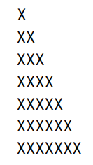

# Change

## Question 1
Complete the tasks detailed in the *"6.092 GravityCalculator.pdf"* document.

## Question 2
Write the main method/function that computes the smallest number of coins of the available denominations that is returned as change by a vending machine.

The amount due and amount tendered are provided as command-line arguments in that order.

Assume that the amounts have no cents, that enough money is tendered, and that enough money is available in the machine. The machine can only return coins,
and the method must therefore print the smallest number of R5, R2, and R1 coins (in this order) that can be used to give change.

**Hint:** Start with the largest coin denomination and then work towards the smaller denominations.

Complete your solution in a program called `Change.java`.

## Question 3
Write a program called `DrawTriangle.java` that takes a single, positive integer as parameter `n` as a command-line argument and then displays a triangular arrangement of X characters on the screen, as illustrated in this image:

The command-line argument `n` species the number of lines in the triangle.