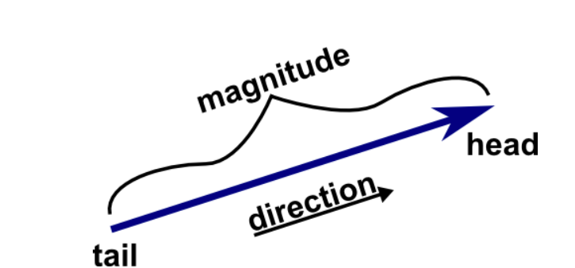

# Object-Oriented Programming in Java

Before you start working on the question you may find it useful to review `Bee.java` in the "code-from-slides" directory.

## Question 1: Library System
You are tasked with creating a simple program to represent a `Book` in a library system. A book has the following attributes:
+ title (`String`)
+ author (`String`)
+ isbn (`String`)
+ availableCopies (`int`)

Your tasks:
1. Create a `Book` class with the attributes listed above. Make sure to:
    + Use proper encapsulation by declaring the attributes as `private`.
    + Provide getter and setter methods for each attribute.
2. Add a method called `borrowBook()` that:
    + Decreases the `availableCopies` by 1, if there are copies available.
    + Prints a message saying "No copies available" if `availableCopies` is 0.
3. Add a method called `returnBook()` that:
    + Increases the `availableCopies` by 1.
4. Write a `main` method to:
    + Create a `Book` object with some initial values.
    + Demonstrate the functionality of `borrowBook()` and `returnBook()` methods.

How does encapsulation in the `Book` class help make your program more robust and maintainable?

## Question 2: Car Rental System
You are designing a program to manage a Car Rental System. Each car has the following attributes:
+ make (`String`)
+ model (`String`)
+ year (`int`)
+ isRented (`boolean`)

Your tasks:

1. Create a `Car` class with the attributes listed above. Ensure:
    + The attributes are `private`.
    + Provide getter and setter methods for each attribute.
2. Add the following methods to the `Car` class:
    + `rentCar()`:
        - Sets `isRented` to `true` if the car is not already rented.
        - Prints a message saying "Car is already rented" if `isRented` is `true`.
    + `returnCar()`:
        - Sets `isRented` to `false` if the car is currently rented.
        - Prints a message saying "Car was not rented" if `isRented` is `false`.
3. Write a `main` method to:
    + Create a `Car` object with some initial values.
    + Demonstrate the functionality of `rentCar()` and `returnCar()` methods.

Why is it a good practice to use *getter* and *setter* methods instead of making the attributes `public`?

## Question 3: Spatial Vectors

A vector is an object that has a magnitude and a direction. Geometrically, we can picture a vector as a directed line segment, whose length is the magnitude of the vector and with an arrow indicating the direction:

The direction of the vector is from its tail to its head.

Vector are a mathematics tool applied in many fields such as Engineering, Statistics, Data Science, Machine Learning etc. This question will see you implement a `Vector` class in Java which has the following properties:
+ An instance variable that is a `double` 1D array. Ensure that it's reference **cannot** be changed.
+ Contains instance methods to:
    - add 2 vectors
    - scale a vector
    - compute the dot product of a vector
    - compute the magnitude of a vector
    - compute the direction of a vector
    - obtain the cartesian value of a given dimension of the vector

The `Vector.java` contains the skeleton you need to fill out. When you are done writing the code complete the [Javadoc](https://www.baeldung.com/javadoc) for the constructor and all the methods as seen in the `CaesarCipher` assignment.

## Question 4: Creating a custom exception in Java

Read the following posts in the given order:
1. https://www.geeksforgeeks.org/exceptions-in-java/
2. https://www.baeldung.com/java-new-custom-exception
3. Then watch: https://www.youtube.com/watch?v=adTDlH0lhaA

Now, explain the workings of the `InvalidDimensionException.java` class. How does it implement an custom exception?